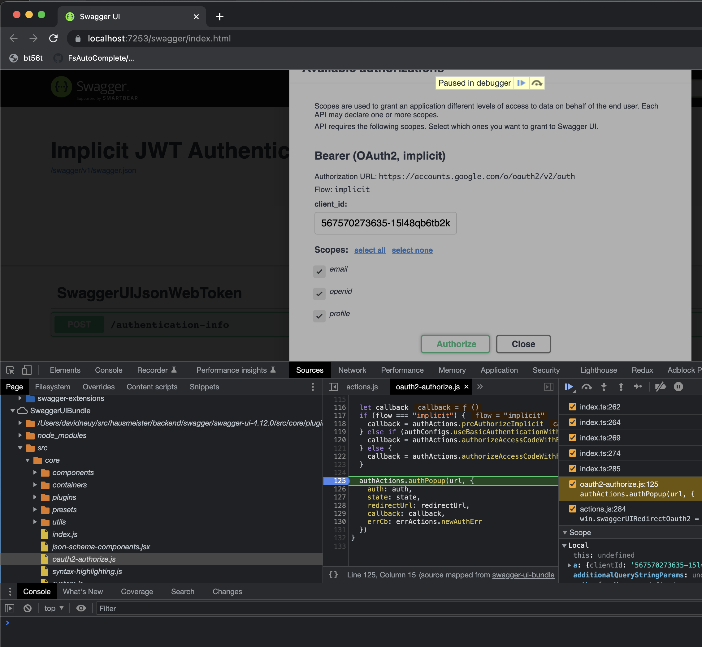

## Example ASP.NET Core (.NET 6) minimal web API project with implicit OAuth flow JSON Web Token authentication.

### Goals

1. Show how to request an id_token with the implicit auth flow from swagger-ui.
2. Show how to validate JWT in ASP.NET Core with a few lines of code and without needing IdentityServer or database tables.
3. Show how to use a self-build swagger-ui artifacts that allow debugging swagger-ui sources. 

### Features

- The id-token generation is started when the user clicks on the swagger-ui "Authorize" button and selects the scopes. To generate the id-token the browser authorizes with the OAuth provider. The custom swagger-ui plugin checks if the submitted nonce matches the nonce in the JWT. Google is used as token provider.
- Swagger-ui uses the id-token for all calls to the server by adding a Bearer authorization header.
- The server validates the JWT in the header using the `Microsoft.AspNetCore.Authentication.JwtBearer` middleware. The middleware uses the public key from the MetadataAddress (.well-known/openid-configuration) to validate the token. The public key is cached and refreshed, if expired, by the middleware. Creation of database tables is not needed.
- After the middleware authenticates the token, the claims from the id-token can be accessed in `context.User.Claims` as demonstrated in the `/authentication-info` resource.
- The ClientSecret is not needed at all.
- If the signature of the JTW is valid, then the data contained in the id-token can be trusted. For example the e-mail address.
- The used swagger-ui-4.12.0 library is self-build with the webpack config value `devtool` set to `'source-map'` to enable debugging the swagger-ui sources in chrome or firefox. This is useful because the latest swagger-ui releases cannot be debugged because the browser is unable to load the source files. 

### How to run

Clone the repository  
`git clone https://github.com/inouiw/SwaggerUIJsonWebToken.git`

Open the solution with VsCode  
`code SwaggerUIJsonWebToken`

Press `F5` to debug

### Details

Swagger UI does not support the OAuth 2.0 implicit grant flow with id_token. Swagger supports OAuth2 implicit flow but it always sets `response_type=token` in the request (see https://github.com/swagger-api/swagger-ui/blob/570d26a0908e7d8cc3c3193e5d9ecbe63e494c0e/src/core/oauth2-authorize.js#L23), however `response_type=token id_token` is required.

Alternatively, to OAuth, swagger-ui also supports OpenID Connect (OIDC), however not the implicit flow but only the authorization code flow. In that case the response from the authorization provider with the code is redirected to the server to a `oauth2-redirect.html` file, then the client secret is sent to the browser together with the code. For me this seems wrong because the client secret should stay on the server.

However, swagger-ui offers very nice ways to extend and customize almost everything. So, I made use of `wrapActions` that are just JavaScript methods which get called any time when a call to the wrapped action is made. (See [Plugin system overview](https://swagger.io/docs/open-source-tools/swagger-ui/customization/overview/))  
I created two wrapActions, one to modify the response_type and one to validate the nonce value. See `wwwroot/swagger-extensions/my-swagger-ui-plugins.js`

### What is the advantage of the implicit flow with id-token instead of the authorization code flow?

The implicit flow has the following advantages:

- It requires a nonce that is generated by the client and then included by the authorization provider in the signed id-token. So the client can verify the nonce and then be sure that the response was not modified with.
- The client can sent the id-token to the server in the authorization header and the server can verify the id-token just by using the public key taken from the `.well-known/openid-configuration`. The public key can be cached for many days. Having the id-token verified the server can be sure that the claims in the token, as the user e-mail, can be trusted.
- The server does not need to store the client-secret because it is not needed.

### Some notes

To intercept the HTTPS Traffic, I use the cross-platform open source HTTP Toolkit.

If you get the error `400: redirect_uri_mismatch` from the authentication provider, as google, then first restart the server and check again, if the error appears again, you will likely need to add your URIs as `https://localhost:7253/swagger/oauth2-redirect.html` to the "Authorized redirect URIs". For google you can set it in the Google Cloud Console. In this application it is never redirected to the redirect URL because the client receives the response from the authentication provider but the redirect link is not followed because it is not needed.

The main file `Program.cs` contains a client-id that I created. You can use [Google Could Console](https://console.cloud.google.com/) to generate your own google client-id.

To read more about the implicit OAuth flow you may start at the google documentation for [OAuth 2.0 for Client-side Web Applications](https://developers.google.com/identity/protocols/oauth2/javascript-implicit-flow).

### Debugging

After starting the solution and opening the browser developer tools, you should be able to see `SwaggerUIBundle` in the Sources tab. You can browse the Swagger-UI source code and set breakpoints.

### Contributors

David Neuy